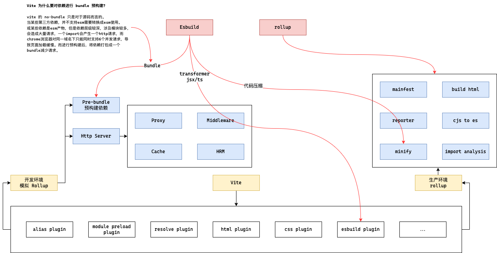

## Vite 为什么要对依赖进行 bundle 预构建?

vite 的 no-bundle 只是对于源码而言的。
1.  当某些第三方依赖，并不支持esm需要转换成esm使用。
2.  某些依赖是esm产物，但是依赖层级较深，涉及模块较多，会造成大量请求，一个import会产生一个http请求，而chrome浏览器对同一域名下只能同时支持6个并发请求，导致页面加载缓慢。而进行预构建后，将依赖打包成一个bundle减少请求

## Vite为什么不使用 esbuild 进行打包？

1.  不支持降级到 es5
2.  不支持 const 等语法。
3.  不提供打包产物的结构
4.  不支持自定义拆包策略
5.  对ts的 transform 并不支持类型检查。( 生产中也用到了，因此在 build时，需要先执行 tsc )

## Vite为什么不使用 `terser` 进行代码压缩，而是使用 `esbuild`
1.  需要大量 `ast` 操作。并且在各个构建流程无法共享，例如 `terser` 与 `babel` 无法共性同一个 `ast`。
2.  `terser`使用 `js` 编写的，而 `esbuild` 是用 `go` 编写的。`js`是解释性语言，需要先转换为子节码再转换为机器码，对于压缩这种任务，性能远不如`go`。
3. `esbuild` 尽可能的共用同一份 `ast`。`go`编写直接编译为机器码，而且在多核并行优势明显。